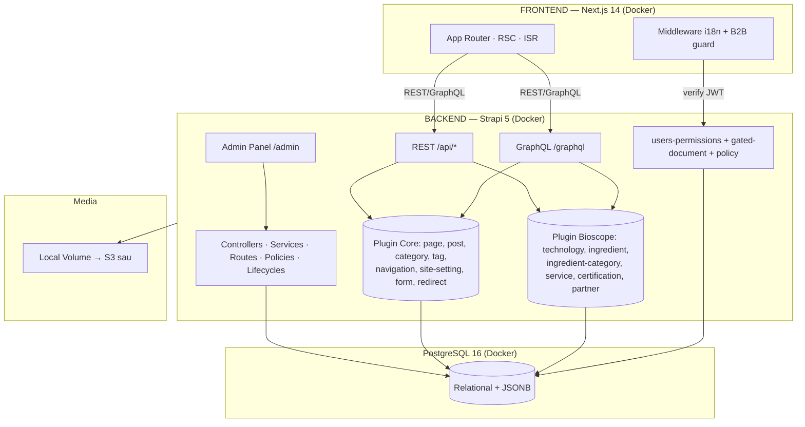

# SRS — BIOSCOPE VIỆT NAM · Backend **Strapi** (phương án thay thế)
> Software Requirements Specification cho backend dựng bằng **Strapi 5** — đối chiếu với bản Payload (`SRS_BIOSCOPE.md`).
> Phiên bản: 1.0 · Ngày: 2026-06-20 · Trạng thái: Blueprint để cân nhắc / vibe-code
>
> ⚠️ Lưu ý: Hiện đã có backend **Payload** chạy được tại `dv-cms/` (core + modules + B2B + blocks + whitelabel admin, self-host Postgres/Docker). Tài liệu này mô tả **phương án Strapi tương đương** để so sánh — chưa phải quyết định thay thế.

---

## 0. TÓM TẮT QUYẾT ĐỊNH (nếu chọn Strapi)

| Hạng mục | Quyết định |
|---|---|
| **Frontend** | Giữ nguyên: Next.js 14 App Router + TS + Tailwind (không đổi) |
| **Backend** | **Strapi 5** (Node + TypeScript), self-host, REST + GraphQL |
| **Database** | **PostgreSQL 16** (Strapi dùng Knex) |
| **Kiến trúc module** | **Strapi plugin = module** đóng gói npm; cài + bật → tự tạo content-type |
| **2 tầng** | Plugin Core (generic) · Plugin Bioscope (đặc thù) · Plugin B2B |
| **i18n** | `@strapi/plugin-i18n` — VI (default) + EN |
| **Auth** | Admin panel (Strapi) + **B2B qua users-permissions** (JWT) + policy duyệt |
| **Media** | Upload plugin (local → S3 provider sau) |
| **Draft/Publish** | Built-in của Strapi |
| **Infra** | **VPS + Docker Compose** (strapi + postgres + Caddy HTTPS) |
| **Design tokens / phong cách** | Giữ nguyên như `SRS_BIOSCOPE.md` (frontend không đổi) |

> Khác biệt cốt lõi so với Payload: schema content-type khai báo bằng **`schema.json`** (không phải TS config); mỗi content-type kéo theo controller/service/route; reuse đa site qua **plugin npm**; Content-Type Builder (UI tạo nhanh) **chỉ chạy ở dev**, prod tạo bằng code.

---

## 1. SYSTEM ARCHITECTURE



### Nguyên tắc
- **Decoupled:** FE và Strapi là 2 container riêng, giao tiếp qua HTTP.
- **Module = plugin:** mỗi nhóm tính năng là một **Strapi plugin** đóng gói npm; cài + `enabled: true` trong `config/plugins.ts` → Strapi tự đăng ký content-type + routes khi boot.
- **i18n:** plugin-i18n; FE dùng `/[locale]`.
- **Caching:** ISR + webhook revalidate qua **lifecycle hook** (`afterCreate/afterUpdate/afterDelete`) gọi `POST {FRONTEND_URL}/api/revalidate`.
- **SEO:** component `seo` (group) gắn vào từng content-type; FE render `generateMetadata` + JSON-LD.

---

## 2. CONTENT MODEL (content-types)

> Strapi: **collection type** ↔ bảng; field `localized` cần bật i18n trên field; quan hệ `relation`; ảnh `media`; nhóm `component`; danh sách `component repeatable` hoặc `JSON`.

### 2.1 Tầng Core (generic — plugin `@dv/strapi-plugin-core`)
| Content-type | Field chính |
|---|---|
| `page` | title (localized), slug (uid), **layout (dynamic zone)** = hero/richText/stats/featureGrid/gallery/cta/videoEmbed/logoCloud, hero (media), seo (component), draft/publish |
| `post` | title/excerpt/content (localized), author (relation user), cover (media), categories/tags (relation), publishedAt, seo |
| `category`, `tag` | name (localized), slug (uid) |
| `redirect` | from, to, type (301/302) |
| `form` + `form-submission` | form: fields (JSON), emails; submission: form (relation), data (JSON) |
| **Single types** | `site-setting` (logo, contact, social, tracking, defaultSeo) · `navigation` (header/footer JSON) |
| **Component** | `shared.seo` (title, description, image, canonical, noIndex) · `shared.link` |

> "Block layout" ở Strapi = **Dynamic Zone** (`layout`) chứa các **component** (hero, stats…). Bật/tắt component nào cho site nào = cấu hình dynamic zone trong plugin.

### 2.2 Tầng Bioscope (plugin `@dv/strapi-plugin-bioscope`)
| Content-type | Field |
|---|---|
| `technology` | name/tagline/description/mechanism (localized), featuredImage, videoUrl, gallery, specs (component repeatable), order, seo |
| `ingredient` | name/slug, type (enum supplement\|cosmetic), category (rel), originCountry, brandName, partner (rel), description, benefits/applications (component repeatable hoặc JSON localized), featuredImage, gallery, technologies (rel m-n), specs, featured, seo, draft/publish |
| `ingredient-category` | name (localized), slug, scope (enum) |
| `service` | title/slug/description (localized), icon, features, order, seo |
| `certification` | title (localized), kind (enum), value, suffix, image, order |
| `partner` | name, country, logo, website |
| **Component** | `shared.spec` (label, value, unit, display enum, percent) |

### 2.3 B2B (plugin `@dv/strapi-plugin-b2b`)
- **Member** = user của `users-permissions` với role **"B2B Member"** + field mở rộng: `company`, `contactName`, `phone`, `status` (pending\|approved\|rejected), `approvedAt`.
- `gated-document`: title (localized), docType (enum COA\|spec_sheet\|quote\|brochure), file (media), visibility (enum approved_members\|specific), allowedMembers (rel users), relatesTo (rel ingredient).
- **Policy** `is-approved-member`: chặn đọc/tải nếu user không phải member approved (và kiểm tra allowedMembers khi visibility=specific).

---

## 3. API CONTRACTS (Strapi 5)

### 3.1 Convention
- Base URL: `https://cms.bioscope.vn`
- Locale: `?locale=vi|en`
- Populate quan hệ/ảnh: `?populate=*` hoặc `?populate[partner]=true&populate[specs]=true`
- Phân trang: `?pagination[page]=1&pagination[pageSize]=12&sort=order:asc`
- Draft/Publish: `?status=published` (mặc định) | `draft`
- **Shape Strapi 5 (đã phẳng, có `documentId`):**
```jsonc
{
  "data": [
    { "id": 12, "documentId": "abc123", "name": "Curcumin 95%", "slug": "curcumin-95",
      "type": "supplement", "originCountry": "IN",
      "partner": { "id": 3, "documentId": "p_xyz", "name": "Rousselot" },
      "specs": [ { "label": "Độ tinh khiết", "value": "99", "unit": "%", "display": "bar" } ],
      "seo": { "title": "…", "description": "…" } }
  ],
  "meta": { "pagination": { "page": 1, "pageSize": 12, "total": 24 } }
}
```
> Khác Payload: bọc trong `data`/`meta`, có `documentId` (id bền qua locale/bản nháp), `populate` thay cho `depth`.

### 3.2 Core / Bioscope (REST auto-sinh)
| Method | Endpoint |
|---|---|
| GET | `/api/pages?filters[slug][$eq]=gioi-thieu&locale=vi&populate=deep` |
| GET | `/api/posts?sort=publishedAt:desc&pagination[pageSize]=9&populate=cover` |
| GET | `/api/ingredients?filters[type][$eq]=supplement&locale=vi&populate=*` |
| GET | `/api/technologies?sort=order:asc&populate=*` |
| GET | `/api/services?sort=order:asc` · `/api/certifications?sort=order:asc` · `/api/partners` |
| GET | `/api/site-setting?locale=vi&populate=*` · `/api/navigation?populate=deep` |
| POST | `/api/form-submissions` |
| — | GraphQL: `POST /graphql` (plugin-graphql) |

### 3.3 B2B
| Method | Endpoint | Mô tả |
|---|---|---|
| POST | `/api/auth/local/register` | Tạo member → mặc định `status=pending` (qua lifecycle) |
| POST | `/api/auth/local` | Đăng nhập → trả JWT |
| GET | `/api/users/me` | Thông tin member (JWT) |
| GET | `/api/b2b/documents` | Tài liệu member được phép (custom controller + policy) |
| GET | `/api/b2b/documents/:id/download` | Tải file, kiểm tra quyền |

> Cookie HTTP-only: FE tự set cookie từ JWT, hoặc dùng header `Authorization: Bearer <jwt>`.

### 3.4 Webhook revalidate
- Lifecycle `afterUpdate/afterCreate/afterDelete` của page/post/ingredient/technology → `POST {FRONTEND_URL}/api/revalidate?secret=...&path=...`. (Hoặc dùng Strapi **Webhooks** built-in trong admin.)

---

## 4. FOLDER STRUCTURE (monorepo — đối xứng dv-cms)

```
bioscope-strapi/                     (hoặc đặt trong dv-strapi/)
├─ packages/
│  ├─ strapi-plugin-core/            @dv/strapi-plugin-core
│  │  └─ server/{content-types,controllers,services,routes,policies,bootstrap}
│  ├─ strapi-plugin-catalog/         @dv/strapi-plugin-catalog  (partner, spec component, product factory)
│  ├─ strapi-plugin-b2b/             @dv/strapi-plugin-b2b      (gated-document, policy, custom routes)
│  └─ strapi-plugin-bioscope/        @dv/strapi-plugin-bioscope (technology, ingredient, service…)
├─ apps/
│  └─ bioscope-strapi/               app Strapi cài + bật các plugin
│     ├─ config/{plugins.ts,database.ts,server.ts,admin.ts,middlewares.ts}
│     ├─ src/admin/app.tsx           # whitelabel: logo, favicon, theme, title
│     ├─ src/index.ts                # register/bootstrap (seed)
│     ├─ Dockerfile
│     └─ .env
├─ docker-compose.yml                # strapi + postgres (+ caddy)
└─ pnpm-workspace.yaml
```

---

## 5. MODULE PATTERN — "cài plugin → tự tạo content-type"

```ts
// config/plugins.ts — bật module cho site này
export default {
  'core':     { enabled: true, resolve: '@dv/strapi-plugin-core' },
  'bioscope': { enabled: true, resolve: '@dv/strapi-plugin-bioscope' },
  'b2b':      { enabled: true, resolve: '@dv/strapi-plugin-b2b' },
  i18n: { enabled: true },
  graphql: { enabled: true },
}
```
- Mỗi plugin chứa `server/content-types/<name>/schema.json` → khi Strapi boot, **tự đăng ký + đồng bộ DB** (tạo bảng) cho content-type đó.
- Bật/tắt theo site = đổi `enabled`. Site khác `pnpm add @dv/strapi-plugin-bioscope` + bật là có ngay.
- Logic kèm theo: `controllers/services/routes/policies/lifecycles` trong plugin.
- ⚠️ **Content-Type Builder (UI) chỉ ghi schema.json ở dev** và **tắt ở production** → prod vẫn là code-first (giống Payload).

---

## 6. VIBE CODING PROMPTS

### 🔵 PROMPT A — Khởi tạo Strapi + Core plugin
```
Tạo backend Strapi 5 (TypeScript) self-host PostgreSQL, i18n VI+EN, GraphQL.
Monorepo pnpm: app `apps/bioscope-strapi` + plugin `@dv/strapi-plugin-core`.
Core content-types (schema.json, có component shared.seo, draft&publish):
page (dynamic zone layout: hero/richText/stats/featureGrid/gallery/cta/videoEmbed/logoCloud),
post + category + tag, redirect, form + form-submission;
single types: site-setting, navigation.
Lifecycle afterUpdate → webhook revalidate FE. Dockerfile + docker-compose (strapi+postgres).
```

### 🟠 PROMPT B — Plugin Bioscope + Catalog
```
Thêm plugin @dv/strapi-plugin-catalog (partner, component shared.spec) và
@dv/strapi-plugin-bioscope: technology, ingredient (type enum, category rel,
partner rel, benefits/applications, specs component, technologies m-n, draft&publish),
ingredient-category, service, certification. Bật i18n + seo cho tất cả. Khớp API §3.2.
```

### 🟢 PROMPT C — B2B (users-permissions)
```
Plugin @dv/strapi-plugin-b2b: mở rộng users-permissions (role "B2B Member" +
company/contactName/phone/status/approvedAt; register mặc định pending qua lifecycle).
gated-document (docType, file, visibility, allowedMembers, relatesTo ingredient).
Policy is-approved-member gác /api/b2b/documents và download (kiểm allowedMembers).
```

---

## 7. NON-FUNCTIONAL
- Performance: Lighthouse ≥ 90 ở FE; Strapi bật cache/CDN cho media.
- SEO: sitemap/robots/hreflang/JSON-LD ở FE; component seo ở BE.
- Security: JWT B2B, CORS chặt (`config/middlewares.ts`), rate-limit `/api/auth`, policy access, validate input.
- Tracking: GA4/GTM qua single type site-setting.
- Deploy: `strapi build` → `strapi start`; docker-compose (strapi+postgres+Caddy HTTPS) trên VPS; volume cho `public/uploads`.
- Migrations: Strapi tự đồng bộ schema khi boot; thay đổi phá huỷ cần thận trọng (backup DB).

---

## 8. ROADMAP
1. Scaffold monorepo + app Strapi + plugin-core + Postgres + Docker → admin chạy.
2. Plugin Catalog + Bioscope (technology/ingredient/…); khớp REST/GraphQL.
3. Plugin B2B (users-permissions + gated-document + policy).
4. Whitelabel admin (`src/admin/app.tsx`: logo/màu/title) + seed.
5. Nối FE (đổi mock data → fetch Strapi, lưu ý shape `data/attributes`/`documentId` + `populate`).
6. Hardening: SEO/JSON-LD, security, tracking, deploy VPS.

---

## 9. STRAPI vs PAYLOAD — chọn cái nào?

| Tiêu chí | Payload (đã có) | Strapi |
|---|---|---|
| Khai báo schema | **TS code-as-config**, type tự sinh | **schema.json** + nhiều file (controller/service/route) |
| Module cài → tự tạo content-type | ✅ plugin TS | ✅ plugin (schema.json) |
| Vibe-code | ✅✅ | 🟡 nhiều quy ước/boilerplate hơn |
| Admin no-code tạo field nhanh | ❌ (code-first) | ✅ Content-Type Builder (chỉ dev) |
| API shape | gọn `{doc/docs}` + `depth` | `{data/meta}` + `documentId` + `populate` |
| i18n / Draft&Publish / Media | built-in | built-in (plugin) |
| Self-host VPS + Postgres + Docker | ✅ | ✅ |
| Giấy phép | MIT | **Strapi: phần lớn MIT**, một số tính năng enterprise trả phí |

**Khuyến nghị:** đã có Payload chạy đúng yêu cầu (code-first, module, B2B, whitelabel, self-host) → **giữ Payload**. Chỉ chuyển sang Strapi nếu ưu tiên **Content-Type Builder no-code lúc dev** và chấp nhận schema JSON + nhiều boilerplate hơn. Tài liệu này để sẵn nếu cần dựng song song / so sánh thực tế.
```
