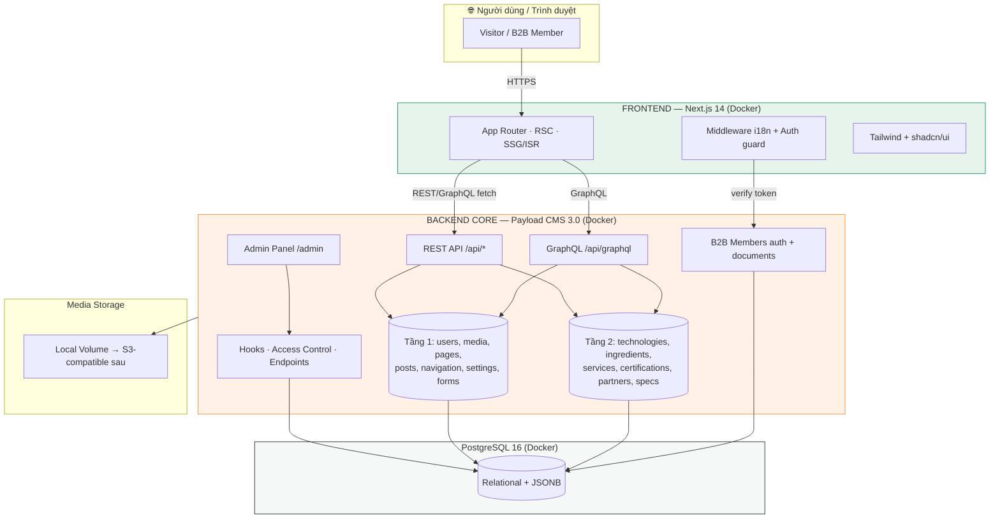
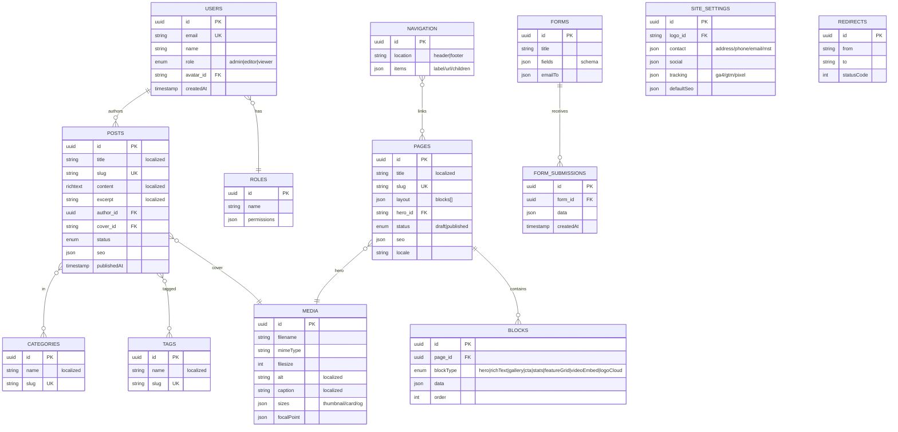
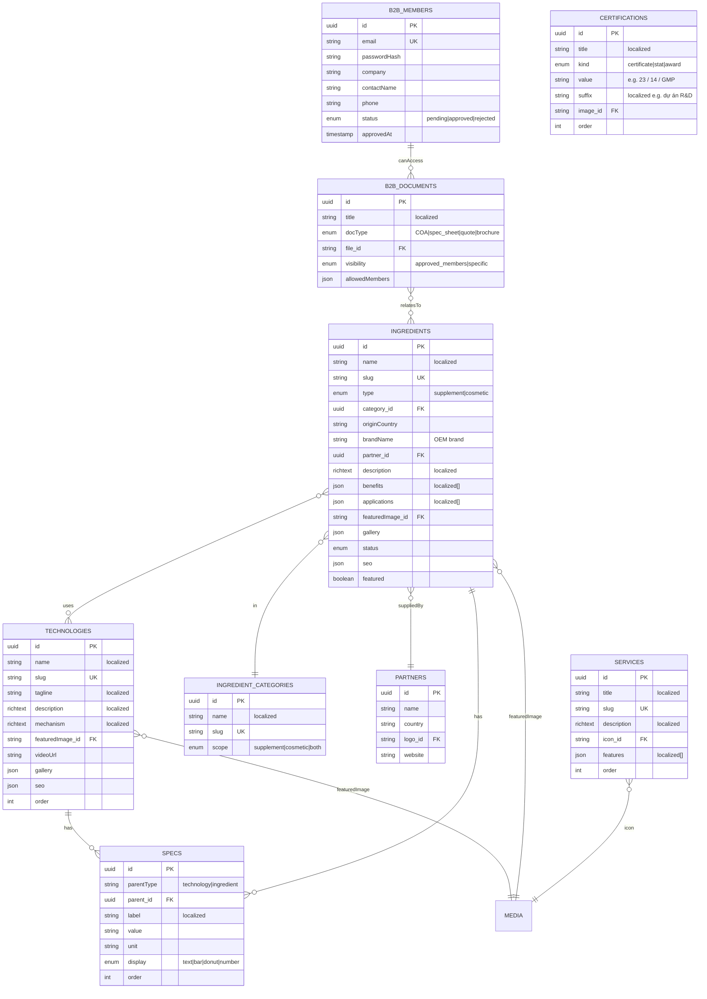

# SRS — BIOSCOPE VIỆT NAM (Headless Rebuild)
> Software Requirements Specification — Tối ưu cho **Vibe Coding** (Cursor / Windsurf / Copilot)
> Phiên bản: 1.0 · Ngày: 2026-06-14 · Trạng thái: Production-ready blueprint

---

## 0. TÓM TẮT QUYẾT ĐỊNH (Locked Decisions)

| Hạng mục | Quyết định |
|---|---|
| **Brand Primary** | `#098F50` (Bio Green) |
| **Brand Accent** | `#F68C36` (Vital Orange) |
| **Neutral Dark / Light** | `#1A2B24` / `#F4F8F6` |
| **Typography** | Heading: **Be Vietnam Pro** · Body: **Inter** (đều full Vietnamese + Latin Extended) |
| **Layout** | Hybrid: **Editorial** (Home/Technologies) + **Minimal/Grid** (Ingredients/Blog/Contact) |
| **Frontend** | **Next.js 14+ App Router** + TypeScript + **Tailwind CSS** + **shadcn/ui** |
| **Backend Core (Tầng 1)** | **Payload CMS 3.0** standalone (Decoupled), REST + GraphQL |
| **Backend Bioscope (Tầng 2)** | Collections + Custom Endpoints + Hooks trên nền Payload |
| **Database** | **PostgreSQL 16** (Drizzle adapter của Payload) |
| **Infra** | **VPS + Docker Compose** self-host |
| **i18n** | **VI + EN** (localization built-in của Payload) |
| **Auth** | Admin (Payload) + **Cổng thành viên B2B** (JWT/HTTP-only cookie) |
| **Scope** | Production đầy đủ. Thứ tự thực thi: **(1) Frontend UI → (2) Core CMS API/Admin → (3) Bioscope modules + B2B** |

### Design Tokens (chốt)
```
--color-primary:        #098F50;
--color-primary-dark:   #066B3B;   /* hover */
--color-primary-tint:   #E6F4EC;   /* badge / subtle bg */
--color-accent:         #F68C36;   /* CTA phụ, highlight, chart */
--color-accent-dark:    #D9701B;
--color-neutral-900:    #1A2B24;   /* body text */
--color-neutral-50:     #F4F8F6;   /* section bg */
--color-white:          #FFFFFF;

--font-heading: "Be Vietnam Pro", system-ui, sans-serif;
--font-body:    "Inter", "Be Vietnam Pro", system-ui, sans-serif;

/* type scale (rem): 0.75 / 0.875 / 1 / 1.125 / 1.5 / 2 / 3 / 4 */
/* radius: sm 6px · md 10px · lg 16px · pill 999px */
/* shadow: card 0 4px 16px rgba(9,143,80,.08) */
```

---

## 1. SYSTEM ARCHITECTURE

### 1.1 Tổng quan giao tiếp



### 1.2 Nguyên tắc kiến trúc
- **Decoupled hoàn toàn:** FE và Payload là 2 service/container riêng. FE chỉ giao tiếp qua HTTP API → Core có thể tái dùng cho nhiều website khác.
- **2-Tier Backend:** Tầng 1 (Core, generic) vs Tầng 2 (Bioscope-specific). Code Tầng 1 có thể tách thành package/template dùng lại.
- **i18n:** Payload `localization` (vi mặc định, en). FE dùng route segment `/[locale]/...`.
- **Caching:** FE dùng ISR (`revalidate`) + on-demand revalidation qua webhook từ Payload `afterChange` hook.
- **SEO:** `@payloadcms/plugin-seo` ở BE; FE render `generateMetadata` + JSON-LD (Organization, Product, Article).

---

## 2. DATABASE SCHEMA (ERD)

> Trong Payload, "Collections" map thành bảng Postgres (qua Drizzle). Các field `localized` sinh bảng `_locales` phụ tự động. ERD dưới mô tả mô hình logic.

### 2.1 Tầng 1 — Core CMS



### 2.2 Tầng 2 — Bioscope Specific



---

## 3. API CONTRACTS

> Payload tự sinh REST (`/api/{collection}`) và GraphQL (`/api/graphql`). Dưới đây là contract chính + các custom endpoint Tầng 2.

### 3.1 Convention chung
- Base URL: `https://cms.bioscope.vn`
- Locale: query `?locale=vi|en` (mặc định `vi`), `?fallback-locale=vi`
- Depth: `?depth=1` để populate relationship.
- Pagination: `?limit=12&page=1&sort=-publishedAt`
- Auth B2B: `Authorization: Bearer <jwt>` hoặc cookie `bio-token` (HTTP-only).

### 3.2 Core (auto REST)
| Method | Endpoint | Mô tả |
|---|---|---|
| GET | `/api/pages?where[slug][equals]=home&locale=vi` | Lấy trang theo slug |
| GET | `/api/posts?limit=9&page=1&sort=-publishedAt&depth=1` | Danh sách blog |
| GET | `/api/posts?where[slug][equals]={slug}` | Chi tiết bài viết |
| GET | `/api/globals/site-settings?locale=vi` | Cấu hình site |
| GET | `/api/globals/navigation` | Menu |
| POST | `/api/form-submissions` | Gửi form liên hệ |

### 3.3 Bioscope (auto REST + custom)
| Method | Endpoint | Mô tả |
|---|---|---|
| GET | `/api/technologies?sort=order&depth=2` | DS công nghệ + specs |
| GET | `/api/technologies?where[slug][equals]={slug}&depth=2` | Chi tiết công nghệ |
| GET | `/api/ingredients?where[type][equals]=supplement&limit=12` | Nguyên liệu TPCN |
| GET | `/api/ingredients?where[type][equals]=cosmetic` | Nguyên liệu mỹ phẩm |
| GET | `/api/ingredients?where[category][equals]={id}&where[originCountry][equals]=JP` | Filter |
| GET | `/api/services?sort=order` | Dịch vụ ODM |
| GET | `/api/certifications?sort=order` | Trust signals |
| GET | `/api/partners` | Đối tác |

### 3.4 B2B Member (custom endpoints)
| Method | Endpoint | Body / Mô tả |
|---|---|---|
| POST | `/api/b2b/register` | `{email, password, company, contactName, phone}` → status=pending |
| POST | `/api/b2b/login` | `{email, password}` → set cookie `bio-token` |
| POST | `/api/b2b/logout` | Clear cookie |
| GET | `/api/b2b/me` | Thông tin member hiện tại |
| GET | `/api/b2b/documents` | DS tài liệu member được phép xem (COA, báo giá...) |
| GET | `/api/b2b/documents/{id}/download` | Signed URL tải file (kiểm tra quyền) |

### 3.5 Webhook (revalidation)
| Method | Endpoint (FE) | Mô tả |
|---|---|---|
| POST | `/api/revalidate?secret=...&path=/...` | Payload `afterChange` hook gọi để ISR revalidate |

### 3.6 Mẫu response (Ingredient)
```json
{
  "doc": {
    "id": "uuid",
    "name": "Marine Sweet® - N-Acetyl-Glucosamin",
    "slug": "marine-sweet-nag",
    "type": "supplement",
    "originCountry": "JP",
    "brandName": "Marine Sweet®",
    "category": { "id": "uuid", "name": "Nguyên liệu TPCN" },
    "partner": { "id": "uuid", "name": "Yaizu Suisankagaku", "country": "JP" },
    "benefits": ["Hỗ trợ khớp", "Dưỡng da"],
    "specs": [
      { "label": "Độ tinh khiết", "value": "99", "unit": "%", "display": "bar" }
    ],
    "featuredImage": { "url": "/media/nag.jpg", "alt": "NAG" },
    "seo": { "title": "...", "description": "..." }
  }
}
```

---

## 4. COMPONENT TREE (Frontend Folder Structure)

```
bioscope-frontend/
├─ src/
│  ├─ app/
│  │  ├─ [locale]/
│  │  │  ├─ layout.tsx                 # Root: fonts, providers, Header, Footer
│  │  │  ├─ page.tsx                   # Trang chủ (Editorial)
│  │  │  ├─ nguyen-lieu/
│  │  │  │  ├─ page.tsx                # Catalog (tabs: TPCN | Mỹ phẩm) + filter
│  │  │  │  └─ [slug]/page.tsx         # Chi tiết nguyên liệu
│  │  │  ├─ cong-nghe/
│  │  │  │  ├─ page.tsx                # DS công nghệ
│  │  │  │  └─ [slug]/page.tsx         # Storytelling + specs + data viz
│  │  │  ├─ dich-vu-odm/page.tsx
│  │  │  ├─ blog/
│  │  │  │  ├─ page.tsx
│  │  │  │  └─ [slug]/page.tsx
│  │  │  ├─ lien-he/page.tsx           # Form (POST /api/form-submissions)
│  │  │  └─ b2b/
│  │  │     ├─ login/page.tsx
│  │  │     ├─ register/page.tsx
│  │  │     └─ (portal)/
│  │  │        ├─ layout.tsx           # Auth guard
│  │  │        └─ documents/page.tsx
│  │  ├─ api/
│  │  │  └─ revalidate/route.ts        # ISR webhook receiver
│  │  ├─ globals.css                   # Tailwind + design tokens
│  │  └─ sitemap.ts / robots.ts
│  ├─ components/
│  │  ├─ ui/                           # shadcn primitives (button, card, tabs...)
│  │  ├─ layout/                       # Header, Footer, LangSwitcher, MobileNav
│  │  ├─ blocks/                       # Block renderer (map blockType → component)
│  │  │  ├─ HeroBlock.tsx
│  │  │  ├─ StatsBlock.tsx             # Trust signals (đếm số animate)
│  │  │  ├─ FeatureGridBlock.tsx
│  │  │  ├─ RichTextBlock.tsx
│  │  │  ├─ GalleryBlock.tsx
│  │  │  ├─ CTABlock.tsx
│  │  │  └─ RenderBlocks.tsx
│  │  ├─ ingredients/                  # IngredientCard, IngredientFilter, TypeTabs
│  │  ├─ technologies/                 # TechHero, MechanismSection, SpecChart, MoleculeSVG
│  │  ├─ shared/                       # SpecBar, SpecDonut, CountUp, SectionHeading
│  │  └─ seo/                          # JsonLd
│  ├─ lib/
│  │  ├─ api.ts                        # fetch wrapper (REST/GraphQL) + types
│  │  ├─ payload-types.ts              # auto-generated từ Payload
│  │  ├─ i18n.ts                       # locale config (vi, en)
│  │  ├─ auth.ts                       # B2B token helpers
│  │  └─ utils.ts                      # cn(), formatters
│  ├─ middleware.ts                    # i18n routing + B2B guard
│  └─ messages/                        # vi.json, en.json (UI strings)
├─ public/
│  └─ fonts/                           # Be Vietnam Pro, Inter (self-host)
├─ tailwind.config.ts                  # map design tokens → theme
├─ next.config.mjs
├─ Dockerfile
└─ .env.local                          # NEXT_PUBLIC_CMS_URL, REVALIDATE_SECRET
```

```
bioscope-cms/  (repo riêng — Payload CMS)
├─ src/
│  ├─ collections/
│  │  ├─ core/          # Users, Media, Pages, Posts, Categories, Tags, Forms...
│  │  └─ bioscope/      # Technologies, Ingredients, Services, Certifications, Partners, Specs
│  ├─ globals/          # SiteSettings, Navigation
│  ├─ blocks/           # Hero, Stats, FeatureGrid, RichText, Gallery, CTA...
│  ├─ access/           # role-based + b2b access functions
│  ├─ endpoints/        # /b2b/* custom routes
│  ├─ hooks/            # afterChange → revalidate FE
│  └─ payload.config.ts # localization {vi,en}, db: postgres, plugins: seo, form-builder
├─ Dockerfile
└─ docker-compose.yml   # cms + postgres + (frontend)
```

---

## 5. VIBE CODING PROMPTS (copy/paste vào AI Editor)

> Thứ tự thực thi theo ưu tiên đã chốt: **(1) Frontend UI trước → (2) Core CMS → (3) Bioscope + B2B**.

### 🟢 PROMPT 1 — Khởi tạo Frontend + Design System (làm TRƯỚC)
```
Bạn là senior Next.js engineer. Khởi tạo dự án frontend cho Bioscope Việt Nam.

STACK: Next.js 14 App Router + TypeScript + Tailwind CSS + shadcn/ui. i18n VI+EN
qua route segment /[locale] và middleware. Dùng next/font tự host Be Vietnam Pro
(heading) và Inter (body).

DESIGN TOKENS (đưa vào tailwind.config.ts + globals.css làm CSS variables):
- primary #098F50, primary-dark #066B3B, primary-tint #E6F4EC
- accent #F68C36, accent-dark #D9701B
- neutral-900 #1A2B24, neutral-50 #F4F8F6
- font-heading: Be Vietnam Pro; font-body: Inter
- radius: sm 6 / md 10 / lg 16; shadow-card: 0 4px 16px rgba(9,143,80,.08)

YÊU CẦU:
1. Setup tailwind + shadcn/ui, map tokens vào theme.
2. Tạo layout: Header (logo, menu: Trang chủ/Nguyên liệu/Công nghệ riêng/Dịch vụ
   ODM/Bioneer's blog/Liên hệ + LangSwitcher VI/EN + nút Đăng nhập B2B + Tìm kiếm),
   Footer (thông tin LIÊN HỆ: tên cty, địa chỉ, MST, hotline, email).
3. Tạo trang chủ phong cách EDITORIAL: Hero gradient green→teal, section giới thiệu,
   section "Cung cấp nguyên liệu" + "Phát triển công thức (ODM)", StatsBlock đếm số
   animate (23 dự án R&D, 14 bằng sáng chế, 4 công nghệ độc quyền), video section.
4. Tạo component dùng lại: SectionHeading, IngredientCard, TechCard, CountUp,
   SpecBar, SpecDonut, Button, Card, Tabs.
5. Dữ liệu tạm thời để trong lib/mock-data.ts (sẽ thay bằng API sau).
6. Mobile-first, responsive, accessible (WCAG AA), micro-interactions hover/scroll-reveal.

Tạo đầy đủ file theo cấu trúc thư mục frontend chuẩn. Code TypeScript strict.
```

### 🔵 PROMPT 2 — Backend Core CMS (Payload Tầng 1)
```
Bạn là senior backend engineer. Tạo Backend Core CMS bằng Payload CMS 3.0
(standalone, decoupled) với PostgreSQL và localization VI+EN.

CẤU HÌNH payload.config.ts:
- db: @payloadcms/db-postgres (DATABASE_URL từ env)
- localization: locales ['vi','en'], default 'vi', fallback true
- plugins: @payloadcms/plugin-seo, @payloadcms/plugin-form-builder
- cors + csrf cho domain frontend

TẠO COLLECTIONS TẦNG 1 (Core, generic dùng lại nhiều web):
- Users (auth, field role: admin|editor|viewer) + Access control theo role
- Media (upload, alt+caption localized, imageSizes: thumbnail/card/og, focalPoint)
- Pages (slug, layout = blocks[] gồm Hero/RichText/Stats/FeatureGrid/Gallery/CTA/
  VideoEmbed/LogoCloud, status draft|published, seo) — title localized
- Posts (blog: title/excerpt/content localized, author rel, cover rel, categories,
  tags, publishedAt, seo) + Categories + Tags
- Redirects
GLOBALS: SiteSettings (logo, contact{address,phone,email,mst}, social, tracking
{ga4,gtm}, defaultSeo) và Navigation (header/footer items với children).

THÊM: afterChange hook gọi webhook revalidate frontend
(POST {FRONTEND_URL}/api/revalidate?secret=...). Tạo Dockerfile + docker-compose
(cms + postgres). Export payload-types tự động. Code TypeScript.
```

### 🟠 PROMPT 3 — Bioscope Modules (Tầng 2) + Cổng B2B
```
Mở rộng Payload CMS đã có (Core Tầng 1) bằng các module đặc thù Bioscope (Tầng 2)
và cổng thành viên B2B.

COLLECTIONS TẦNG 2 (localized VI+EN, có seo, sort order):
- Technologies: name, slug, tagline, description(richText), mechanism(richText),
  featuredImage, videoUrl, gallery, + relationship hasMany Specs.
- Ingredients: name, slug, type(select supplement|cosmetic), category(rel),
  originCountry, brandName, partner(rel), description, benefits(array localized),
  applications(array localized), featuredImage, gallery, featured(bool),
  technologies(relationship hasMany), specs(rel hasMany), status.
- IngredientCategories: name, slug, scope(supplement|cosmetic|both)
- Services: title, slug, description, icon, features(array)
- Certifications: title, kind(certificate|stat|award), value, suffix, image, order
- Partners: name, country, logo, website
- Specs: parentType, parent(rel), label(localized), value, unit, display(text|bar|
  donut|number), order

CỔNG B2B:
- Collection B2BMembers (auth: true): email, company, contactName, phone,
  status(pending|approved|rejected). Đăng ký mặc định pending; chỉ admin approve.
- Collection B2BDocuments: title, docType(COA|spec_sheet|quote|brochure), file
  (upload), visibility(approved_members|specific), allowedMembers, relatesTo
  (rel Ingredients).
- Custom endpoints dưới /api/b2b: register, login (set HTTP-only cookie), logout,
  me, documents (chỉ trả tài liệu member được phép), documents/:id/download
  (kiểm tra quyền, trả signed/streamed file).
- Access control: B2BDocuments chỉ đọc được khi member status=approved và nằm
  trong allowedMembers (nếu visibility=specific).

Cập nhật payload-types và đảm bảo afterChange revalidate các route liên quan
(technologies, ingredients) trên frontend.
```

---

## 6. NON-FUNCTIONAL REQUIREMENTS
- **Performance:** Lighthouse ≥ 90 (Perf/SEO/A11y). LCP < 2.5s. next/image + ISR.
- **SEO:** sitemap.xml, robots.txt, hreflang VI/EN, JSON-LD (Organization, Product, Article, BreadcrumbList).
- **Security:** HTTP-only cookie cho B2B, CORS chặt, rate-limit endpoint auth, helmet headers, validate input (zod ở FE), Payload access control ở BE.
- **Tracking:** GA4 + GTM cấu hình qua SiteSettings (consent-aware).
- **Observability:** healthcheck endpoint, logs JSON, error boundary FE.
- **Deploy:** docker-compose (frontend, cms, postgres, + reverse proxy Caddy/Nginx với HTTPS Let's Encrypt) trên VPS.

---

## 7. ROADMAP THỰC THI
1. **Sprint 1 — Frontend UI** (PROMPT 1): scaffold + design system + Home + component library + mock data. → *Chốt giao diện.*
2. **Sprint 2 — Core CMS** (PROMPT 2): Payload Tầng 1 + Postgres + admin + i18n + nối FE thật cho Pages/Blog.
3. **Sprint 3 — Bioscope Modules** (PROMPT 3): Technologies/Ingredients/Services/Certifications/Partners + trang catalog/detail + data viz.
4. **Sprint 4 — B2B Portal**: auth + documents + access control.
5. **Sprint 5 — Hardening**: SEO/JSON-LD, performance, tracking, security, dockerize, deploy VPS.
```
```
```
